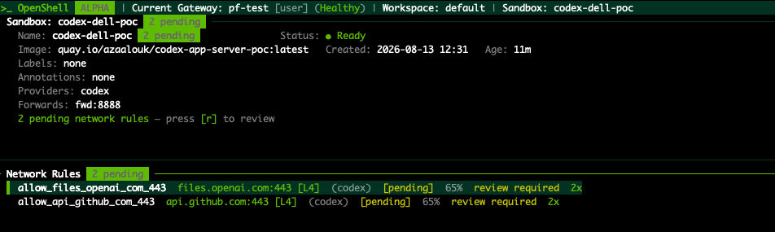
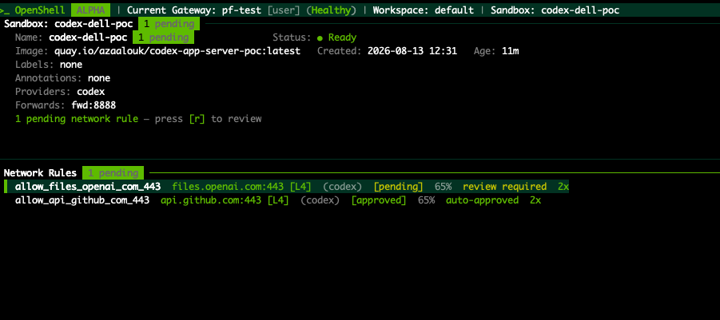
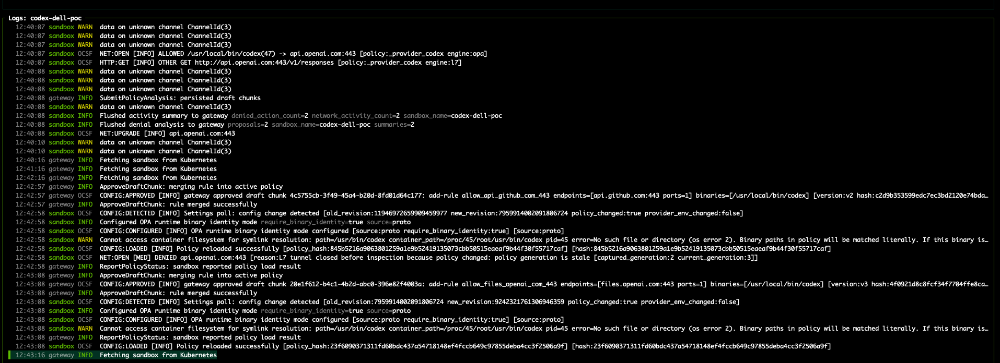

# Codex + OpenShell: Governed Agent Sandbox

Run OpenAI Codex CLI on your laptop. Execute agent workloads inside a security-hardened [NVIDIA OpenShell](https://github.com/NVIDIA/OpenShell) sandbox on OpenShift. No SSH tunnel. No sidecar. No scripts.

## What this demonstrates

- **Codex CLI on your laptop** — UI and agent loop run locally, as OpenAI designed
- **Codex App Server in an OpenShell sandbox** — execution is isolated on the cluster (Landlock + seccomp + deny-default networking)
- **WebSocket transport** — `codex --remote ws://localhost:8888` connects via OpenShell's port-forward. No SSH, no sidecar, no port-forward scripts
- **OPA policy engine** — intercepts unknown egress, queues rules for review, hot-reloads approved rules without restarting the sandbox
- **Credential injection** — Codex OAuth tokens injected by OpenShell provider; the sandbox process never sees them directly
- **OCSF v1.7 audit trail** — every network connection logged with policy decision, binary identity, and engine tag. SIEM-ready

## Architecture

```
Developer Laptop                OpenShell Gateway (OCP)         OpenShell Sandbox
┌─────────────────┐             ┌───────────────────────┐       ┌──────────────────────────┐
│ Codex CLI / TUI │──ws:8888──>│ OPA Policy Engine      │──────>│ Codex App Server         │
│ (UI only)       │             │ MCP Policy Proxy       │       │ Agent loop · Tool calling │
│                 │             │ Credential Injection   │       │ Landlock + seccomp        │
│ REMOVED:        │             │ Lifecycle Management   │       │ Network NS · deny-default │
│ bwrap, Landlock │             │ OCSF Audit Events      │       │                          │
│ execpolicy      │             └───────────────────────┘       └──────────────────────────┘
└─────────────────┘
```

## How it works vs the SSH workaround

A common pattern for remote agent execution is to SSH the entire agent stack into a remote container. This PoC takes a different approach:

| | SSH workaround | This PoC |
|---|---|---|
| Agent CLI location | Remote container | Developer's laptop |
| Connection | SSH tunnel + port-forward scripts | `--forward 8888` via OpenShell gateway |
| Sandboxing | bubblewrap inside pod (no egress control) | OpenShell (Landlock + seccomp + deny-default network) |
| Egress control | None | OPA policy per binary, hot-reloadable |
| Credential handling | Visible to process | Injected, never exposed |
| Audit trail | None | OCSF v1.7 events |

## Prerequisites

- [OpenShell](https://github.com/NVIDIA/OpenShell) CLI with a gateway pointing to an OpenShift cluster
- Codex CLI installed locally (`codex --version`)
- Docker and access to a container registry

## Quick start

### 1. Build and push the sandbox image

```bash
docker buildx build \
  --platform linux/amd64 \
  -t <your-registry>/codex-app-server:latest \
  --push .
```

### 2. Create the Codex provider

```bash
python3 - << 'EOF'
import json, subprocess, sys

with open('/Users/<you>/.codex/auth.json') as f:
    tokens = json.load(f)['tokens']

cmd = [
    'openshell', 'provider', 'create',
    '--type', 'codex', '--name', 'codex',
    '--credential', f'access_token={tokens["access_token"]}',
    '--credential', f'refresh_token={tokens["refresh_token"]}',
    '--credential', f'account_id={tokens["account_id"]}',
    '--credential', f'id_token={tokens["id_token"]}',
]
result = subprocess.run(cmd, capture_output=True, text=True)
print(result.stdout or result.stderr)
EOF
```

### 3. Create the sandbox

```bash
TOKEN=$(openssl rand -hex 24)

openshell sandbox create \
  --from <your-registry>/codex-app-server:latest \
  --provider codex \
  --forward 8888 \
  --name codex-poc \
  --env CODEX_WS_TOKEN=$TOKEN \
  -- /usr/local/bin/start.sh
```

### 4. Connect from your laptop

```bash
export CODEX_WS_TOKEN="<token from step 3>"
codex --remote ws://localhost:8888 --remote-auth-token-env CODEX_WS_TOKEN
```

## How the sandbox image works

`Dockerfile` installs the Codex Linux binary (musl, statically linked) on `debian:bookworm-slim` with `iproute2` and `nftables` for OpenShell's network namespace management.

`start.sh`:
1. Writes `CODEX_WS_TOKEN` to `/tmp/codex-ws-token`
2. If `CODEX_AUTH_*` env vars are present (injected by the OpenShell provider), writes them to `~/.codex/auth.json`
3. Starts `codex app-server --listen ws://0.0.0.0:8888 --ws-auth capability-token`

## OpenShell provider

The `codex` provider is defined in [upstream OpenShell](https://github.com/NVIDIA/OpenShell/blob/main/providers/codex.yaml). It specifies:
- Allowed egress: `api.openai.com`, `auth.openai.com`, `chatgpt.com`
- Credential injection: `CODEX_AUTH_ACCESS_TOKEN`, `CODEX_AUTH_REFRESH_TOKEN`, `CODEX_AUTH_ACCOUNT_ID`, `CODEX_AUTH_ID_TOKEN`
- Per-binary enforcement: `/usr/local/bin/codex`

Any egress not in this list is intercepted by OPA and queued for human review.

## Demo

| | |
|---|---|
|  |  |
| OpenShell catches unknown egress (files.openai.com, api.github.com) | OPA auto-approves high-confidence rules, holds others for review |


*OCSF v1.7 audit events: NET:OPEN ALLOWED with policy engine tag, binary identity, policy hot-reload*

[Demo video](demo/codex-openshell-demo.mp4)

## Roadmap

- [ ] Fix auth injection — `start.sh` should write `CODEX_AUTH_*` env vars to `auth.json` automatically, removing the manual API key step
- [ ] Native OpenShell sandbox driver in `codex-rs` — same pattern as the [Agents SDK provider](https://github.com/openai/openai-agents-python), eliminates the WebSocket shim entirely
- [ ] Enterprise MCP connectors — add data platform connectors to the sandbox image and policy

## Related

- [NVIDIA/OpenShell](https://github.com/NVIDIA/OpenShell)
- [OpenShell codex provider](https://github.com/NVIDIA/OpenShell/blob/main/providers/codex.yaml)
- [zanetworker/sandboxing-anywhere](https://github.com/zanetworker/sandboxing-anywhere) — OpenShell integration experiments across agent frameworks
